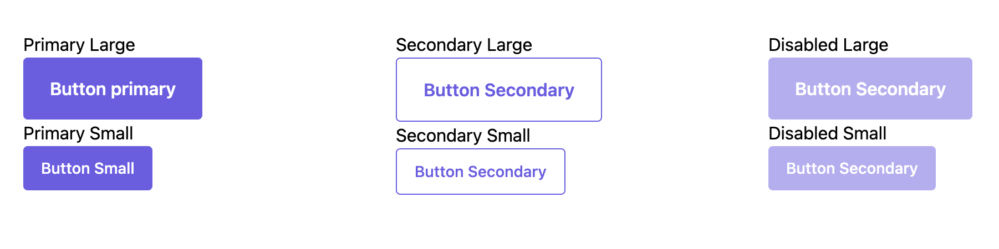
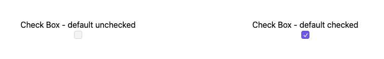
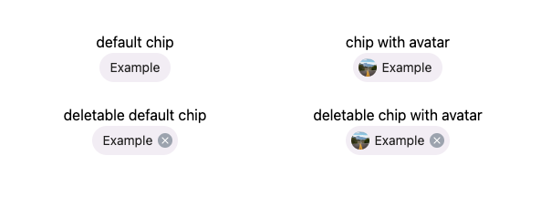
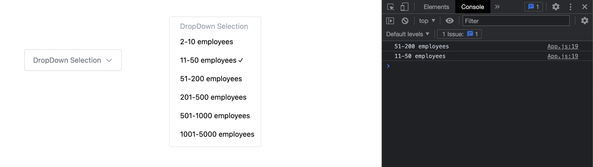
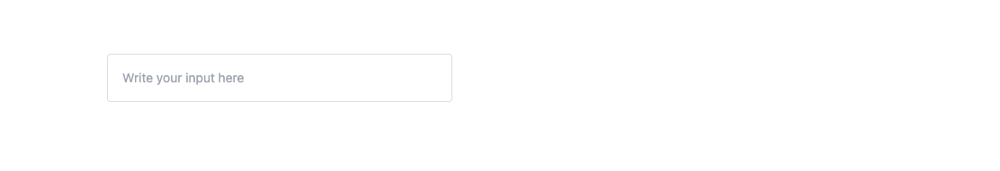
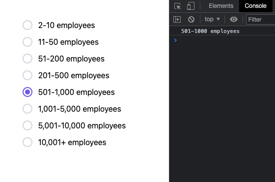

# Design System of Expertia.AI

<p>
    <a href="https://www.expertia.ai/"  >
      
    <h1>Expertia.Ai</h1></a><br>
    Use Tailwind CSS to build the components
</p>

---

## Getting started

By integrating this package as a plugin to your current Tailwind CSS project, you can expedite website development through the utilization of a collection of web components constructed with the utility classes provided by Tailwind CSS.

### Install using NPM

Make sure that you have <a href="https://nodejs.org/en/" rel="nofollow" >Node.js</a> and <a href="https://tailwindcss.com/" rel="nofollow" >Tailwind CSS</a> installed.

<!-- 1. Install all dependencies using NPM by running the following command:

```bash
npm install -S "git+https://expertiaai/ui.git"
```

--- -->

1. Authenticate to GitHub Packages.

   1. Get the `personal access token`

   -- In the upper-right corner of any page, click your profile photo, then click `Settings`.
   -- In the left sidebar, click `Developer settings`.
   -- In the left sidebar, under Personal access tokens, click Fine-grained tokens.
   -- Click `Generate new token`.
   -- Under Token name, enter a name for the token.
   -- Select `repo, write and read`
   -- Press `Generate Token`.
   -- Copy the Token Generated.

   2. Create a `.npmrc file` and add the personal access token

   ```
   //npm.pkg.github.com/:_authToken=TOKEN
   ```

   3. To authenticate by logging in to npm, use the `npm login` command, replacing USERNAME with your GitHub username, TOKEN with your personal access token (classic), and PUBLIC-EMAIL-ADDRESS with your email address.

   ```
   npm login --scope=@expertiaai --auth-type=legacy --registry=https://npm.pkg.github.com

   > Username: USERNAME
   > Password: TOKEN

   ```

2. Edit the .npmrc file in root directory to include specifying GitHub Packages URL and the namespace where the package is hosted.

```
@expertiaai:registry=https://npm.pkg.github.com
```

3. Configure `package.json` in your project to use the package you are installing. To add your package `dependencies` to the `package.json` file for GitHub Packages, specify the full-scoped package name, such as @my-org/server.

```
{
  "name": "@my-org/server",
  "version": "1.0.0",
  "description": "",
  "main": "index.js",
  "author": "",
  "license": "MIT",
  "dependencies": {
    "@expertiaai/ui": "github:expertiaai/ui"
  }
}
```

4. Install package

```
npm install
```

Here's an example how you can import and create a new component inside JavaScript:

1. Buttons

```javascript
import { Button } from "@expertiaai/ui";

export default function Example() {
  return (
    <div>
      <p>Primary Large</p>
      <Button>
        <p>Button primary</p>
      </Button>

      <p>Primary Small </p>
      <Button small>Button Small</Button>

      <p>Secondary Large</p>
      <Button secondary>Button Secondary</Button>

      <p>Secondary Small</p>
      <Button secondary small>
        Button Secondary
      </Button>

      <p>Disabled Large</p>
      <Button disabled>Button Secondary</Button>

      <p>Disabled Small</p>
      <Button disabled small>
        Button Secondary
      </Button>
    </div>
  );
}
```

<br />
<p align="center">

</p>

Primary Large Button is the Default Button,
`samll` - converts to Small button,
`secondary` - converts to Secondary (outlined) Button,
`disabled` - converts to Disabled Button.

2. Checkbox

```javascript
import { Checkbox1 } from "@expertiaai/ui";

export default function Example() {
  return (
    <div className="m-auto w-[70vw] mt-10 grid grid-cols-3">
      <div className="flex justify-center flex-col items-center">
        <div>Check Box - default unchecked</div>
        <Checkbox1 />
      </div>
      <div className="flex justify-center flex-col items-center">
        <div>Check Box - default checked</div>
        <Checkbox1 defaultChecked />
      </div>
    </div>
  );
}
```

<br />
<p align="center">

</p>

checkbox is not checked initially, `defaultChecked` will make the checkbox checked on bydefault.

3. Chips

```javascript
import { Chips } from "@expertiaai/ui";

export default function Example() {
  return (
    <div className="m-auto w-[70vw] mt-10 grid grid-cols-3">
      <div className="flex justify-center flex-col items-center">
        <div>default chip</div>
        <Chips>Example</Chips>
      </div>

      <div className="flex justify-center flex-col items-center">
        <div>chip with avatar</div>
        <Chips avatar="https://images.unsplash.com/photo-1677607633013-b733166ab535?ixlib=rb-4.0.3&ixid=MnwxMjA3fDB8MHxlZGl0b3JpYWwtZmVlZHw5fHx8ZW58MHx8fHw%3D&auto=format&fit=crop&w=800&q=60">
          Example
        </Chips>
      </div>

      <div className="flex justify-center flex-col items-center">
        <br></br>

        <div>deletable default chip </div>
        <Chips deletable>Example</Chips>
      </div>

      <div className="flex justify-center flex-col items-center">
        <br></br>

        <div>deletable chip with avatar </div>
        <Chips
          deletable
          avatar="https://images.unsplash.com/photo-1677607633013-b733166ab535?ixlib=rb-4.0.3&ixid=MnwxMjA3fDB8MHxlZGl0b3JpYWwtZmVlZHw5fHx8ZW58MHx8fHw%3D&auto=format&fit=crop&w=800&q=60"
        >
          Example
        </Chips>
      </div>
    </div>
  );
}
```

<br />
<p align="center">

</p>

Default chips are not deletable and don't have any avatars, can add `avatar` and `deletable` tags.

4. DropDown

```javascript
import { DropDown } from "@expertiaai/ui";

export default function Example() {
  const CompanySizeOptions = [
    "2-10 employees",
    "11-50 employees",
    "51-200 employees",
    "201-500 employees",
    "501-1000 employees",
    "1001-5000 employees",
  ];
  return (
    <div className="flex w-full justify-center item-center">
      <DropDown className="mx-24" options={CompanySizeOptions}>
        DropDown Selection
      </DropDown>
      <DropDown
        options={CompanySizeOptions}
        onValueChange={(e) => console.log(e)}
      >
        DropDown Selection
      </DropDown>
    </div>
  );
}
```

<br />
<p align="center">

</p>

The options for this dropdown are being passed as an array of strings through the "options" prop.The prop "onValueChange" that is being used to capture the value of the selected option.

5. Input

```javascript
import { Input } from "@expertiaai/ui";

export default function Example() {
  return (
    <div>
      <Input className="w-96" placeholder="Write your input here" />
    </div>
  );
}
```

<br />
<p align="center">

</p>

6. Label

```javascript
import { Label } from "@expertiaai/ui";

export default function Example() {
  return (
    <div>
      <div>
        <Label>Label 1</Label>
      </div>
      <div>
        <Label className="bg-green-500">Label 2</Label>
      </div>
    </div>
  );
}
```

<br />
<p align="center">

</p>

You can change the color of the label by adding a className

7. Toast

```javascript
import { Toast } from "@expertiaai/ui";

export default function Example() {
  return (
    <div>
      <Toast
        position="topRight"
        time="10000"
        className="px-4"
        label="Success"
        open={open}
        setOpen={setOpen}
      >
        <div className="text-white bg-green-500 py-2 px-4 rounded flex justify-center item-center">
          <svg
            className="translate-y-1 mr-2"
            xmlns="http://www.w3.org/2000/svg"
            width="17"
            height="17"
            fill="#fff"
            viewBox="0 0 256 256"
          >
            <rect width="256" height="256" fill="none"></rect>
            <polyline
              points="144 84 56 172 12 128"
              fill="none"
              stroke="#fff"
              stroke-linecap="round"
              stroke-linejoin="round"
              stroke-width="24"
            ></polyline>
            <polyline
              points="244 84 156 172 139.9 155.9"
              fill="none"
              stroke="#fff"
              stroke-linecap="round"
              stroke-linejoin="round"
              stroke-width="24"
            ></polyline>
          </svg>
          <span>This is a success message!</span>
        </div>
      </Toast>
    </div>
  );
}
```

<br />
<p align="center">

</p>

Toast has 5 input properties

A. `open` - Boolean value
B. `setOpen` - function to set `open` property.
C. `time` - duration till the toast auto hides.
D. `label` - simple label for trigger.
E. `position` - This property specifies the position of the message. Property given in `camel case`. The default is always `Bottom Left`.
top,
topLeft,
topRight,
bottom,
bottomLeft,
bottomRight
<br />

8. Pagination

```javascript
import { Pagination } from "@expertiaai/ui";

export default function Example() {
  const [currentColor, setCurrentPage] = useState(1);

  return (
    <div>
      <Pagination
        currentPage={currentColor}
        totalPages={10}
        onPrev={setCurrentPage}
        onNext={setCurrentPage}
      />
    </div>
  );
}
```

<br />
<p align="center">

</p>

Pagination has 3 properties as input ,

A. `currentPage` - Specifies the current page.
B. `totalages` - Specifies total number of pages.
C. `onPrev` & `onNext` - Specifies the function to trigger on clicking next or prev.

9. ProgressBar

```javascript
import { ProgressBar } from "@expertiaai/ui";

export default function Example() {
  return (
    <div>
      <ProgressBar progress={90} />
    </div>
  );
}
```

<p align="center">

</p>

Progress bar takes only one input `progress` which basically indicates the progress in percentage.

10. Radio

```javascript
import { Radio } from "@expertiaai/ui";

export default function Example() {
  return (
    <div>
      <Radio onValueChange={(e) => console.log(e)}>{initialOptions}</Radio>
    </div>
  );
}
```

<p align="center">

</p>

The options for this dropdown are being passed as an array of objects with 2 keys `value` and `label` .The prop "onValueChange" that is being used to capture the value of the selected option.

11. Ratings

```javascript
import { Radio } from "@expertiaai/ui";

export default function Example() {
  return (
    <div>
      <div className="grid grid-cols-2 text-yellow-500">
        3.3
        <Ratings ratings={3.3} />
      </div>
      <div className="grid grid-cols-2 text-red-500">
        2.0
        <Ratings ratings={2} size={20} />
      </div>
      <div className="grid grid-cols-2 text-green-500">
        4.5
        <Ratings ratings={4.5} size={25} />
      </div>
    </div>
  );
}
```

<p align="center">

</p>

Ratings will take 2 props ratings and size.

12. Selector

```javascript
import { Slider1 } from "@expertiaai/ui";

export default function Example() {
  return (
    <div>
      <Slider1 value={val} onValueChange={(e) => setVal(e)} />
      <div className="py-2">{val}</div>
    </div>
  );
}
```

<p align="center">

</p>

Slider takes 2 props ,one is the `value` and the other is `onValueChange`.

13. Switch

```javascript
import { Switch1 } from "@expertiaai/ui";

export default function Example() {
  return (
    <div>
      <div>
        <span>Default Switch</span>
        <Switch1 />
      </div>
      <div>
        <span>Default Checked Switch</span>
        <Switch1 defaultChecked />
      </div>
    </div>
  );
}
```

<p align="center">

</p>

Switch take only one prop `defaultChecked` if the switch need to be checked by default.

14. ToolTip

```javascript
import { ToolTip } from "@expertiaai/ui";

export default function Example() {
  return (
    <div>
      <ToolTip
        className="bg-white text-md border shadow-md px-5"
        text="important message !"
      >
        <svg
          xmlns="http://www.w3.org/2000/svg"
          width="15"
          height="15"
          fill="#1f0505"
          viewBox="0 0 256 256"
        >
          <rect width="256" height="256" fill="none"></rect>
          <circle
            cx="128"
            cy="128"
            r="96"
            fill="none"
            stroke="#1f0505"
            stroke-linecap="round"
            stroke-linejoin="round"
            stroke-width="24"
          ></circle>
          <polyline
            points="120 124 128 124 128 176 136 176"
            fill="none"
            stroke="#1f0505"
            stroke-linecap="round"
            stroke-linejoin="round"
            stroke-width="24"
          ></polyline>
          <circle cx="126" cy="84" r="16"></circle>
        </svg>
      </ToolTip>
    </div>
  );
}
```

<p align="center">

</p>

ToolTip takes only one prop `text` which contains the text.

